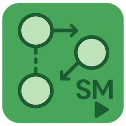
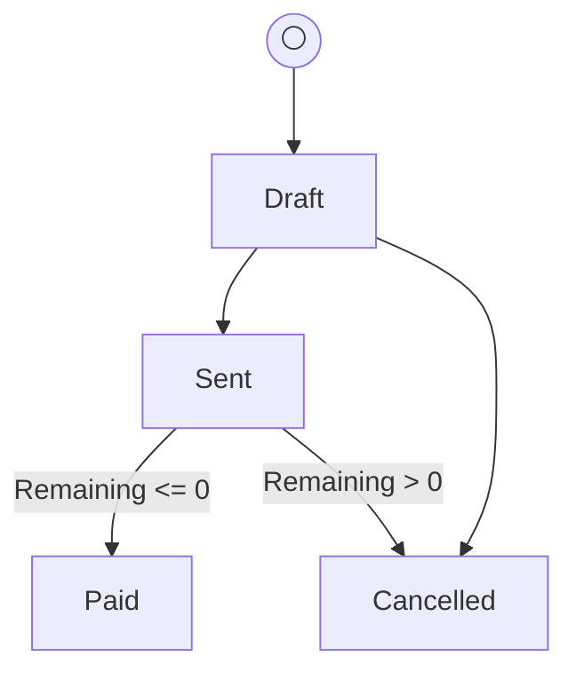

# SlimStateMachine



[](https://www.nuget.org/packages/SlimStateMachine/)
[](LICENSE)

A lightweight C# library for defining and managing state machines based on an entity class and an enum property representing its state.

## Features

*   **Generic:** Define state machines for any entity (`TEntity`) and its status enum (`TEnum`).
*   **Fluent Configuration:** Use a builder pattern to define the initial state and allowed transitions.
*   **Static Access:** Interact with the state machine using static methods (`StateMachine<TEntity, TEnum>.CanTransition(...)`, etc.).
*   **Cached Configuration:** State machine definitions are cached for performance after the initial configuration.
*   **Transition Information:** Query possible transitions from the current state or any given state.
*   **Final State Detection:** Check if a state is a final state (no outgoing transitions) or if an entity is currently in a final state.
*   **Pre-conditions:** Define conditions (`Func<TEntity, bool>`) that must be met for a transition to occur.
*   **Post-conditions (Actions):** Define actions (`Action<TEntity>`) to be executed *after* a successful transition (before the state property is updated).
*   **Automatic State Update:** The `TryTransition` method automatically updates the entity's status property upon successful transition.
*   **Mermaid Graph Generation:** Generate a [Mermaid.js](https://mermaid.js.org/) graph definition string to visualize the state machine, including pre-condition descriptions.
*   **D2 Graph Generation:** Generate a [D2](https://d2lang.org/) graph definition string to visualize the state machine, including pre-condition descriptions.
*   **Thread-Safe:** Configuration is thread-safe. Runtime access (checking/performing transitions) assumes the entity instance is handled appropriately by the calling code (e.g., not mutated concurrently during a transition check).

## Installation

Install the package via NuGet Package Manager:

```
Install-Package SlimStateMachine
```

Or using .NET CLI:

```
dotnet add package SlimStateMachine
```

## Supported Platforms

- .NET 9.0
- .NET 8.0
- .NET Standard 2.0

## Usage

### 1. Define Your Entity and Enum

```csharp
// Example: Invoice Management
public enum InvoiceStatus
{
    Draft,
    Sent,
    Paid,
    Cancelled
}

public class Invoice
{
    public int Id { get; set; }
    public InvoiceStatus Status { get; set; } // The state property
    public decimal TotalAmount { get; set; }
    public decimal AmountPaid { get; set; }
    public decimal RemainingAmount => TotalAmount - AmountPaid;
    public string? Notes { get; set; }

    // You might initialize the status in the constructor or rely on the state machine's initial state
    public Invoice()
    {
        // Status defaults to 'Draft' (enum default) which matches our example initial state
    }
}
```

### 2. Configure the State Machine

This should typically be done once during application startup (e.g., in `Program.cs` or a static constructor).

```csharp
using SlimStateMachine;

// --- Configuration (Do this once at startup) ---
StateMachine<Invoice, InvoiceStatus>.Configure(
    // 1. Specify the property holding the state
    invoice => invoice.Status,

    // 2. Use the builder to define the state machine rules
    builder =>
    {
        // 2a. Set the initial state for new entities (if not set explicitly)
        builder.SetInitialState(InvoiceStatus.Draft);

        // 2b. Define allowed transitions
        builder.AllowTransition(InvoiceStatus.Draft, InvoiceStatus.Sent);

        // 2c. Transition with a Pre-condition
        builder.AllowTransition(
            InvoiceStatus.Sent,
            InvoiceStatus.Paid,
            preCondition: inv => inv.RemainingAmount <= 0, // Func<Invoice, bool>
            preConditionExpression: "Remaining <= 0"       // String for Mermaid graph
        );

        // 2d. Transition with a Post-condition (Action)
        builder.AllowTransition(
            InvoiceStatus.Draft,
            InvoiceStatus.Cancelled,
            postAction: inv => inv.Notes = "Cancelled while in Draft." // Action<Invoice>
        );

        // 2e. Transition with both Pre- and Post-conditions
        builder.AllowTransition(
            InvoiceStatus.Sent,
            InvoiceStatus.Cancelled,
            preCondition: inv => inv.RemainingAmount > 0,   // Can only cancel if not fully paid
            preConditionExpression: "Remaining > 0",
            postAction: inv => inv.Notes = "Cancelled after sending (partially paid)."
        );
    }
);
// --- End Configuration ---
```

### 3. Interact with the State Machine

```csharp
// Create an entity instance
var myInvoice = new Invoice { Id = 101, TotalAmount = 500, AmountPaid = 0 };
// Initial state is implicitly Draft (enum default), matching configured InitialState

// Check if a transition is possible
bool canSend = StateMachine<Invoice, InvoiceStatus>.CanTransition(myInvoice, InvoiceStatus.Sent); // true
bool canPay = StateMachine<Invoice, InvoiceStatus>.CanTransition(myInvoice, InvoiceStatus.Paid);   // false (Remaining > 0)

Console.WriteLine($"Can send invoice {myInvoice.Id}? {canSend}");
Console.WriteLine($"Can pay invoice {myInvoice.Id}? {canPay}");

// Get possible next states
var possibleStates = StateMachine<Invoice, InvoiceStatus>.GetPossibleTransitions(myInvoice);
// possibleStates will contain [Sent, Cancelled] for the initial Draft state in this config

Console.WriteLine($"Possible next states for invoice {myInvoice.Id}: {string.Join(", ", possibleStates)}");

// Attempt a transition
bool transitionSucceeded = StateMachine<Invoice, InvoiceStatus>.TryTransition(myInvoice, InvoiceStatus.Sent);

if (transitionSucceeded)
{
    Console.WriteLine($"Invoice {myInvoice.Id} transitioned to: {myInvoice.Status}"); // Status is now Sent
}

// Now try to pay - still fails precondition
transitionSucceeded = StateMachine<Invoice, InvoiceStatus>.TryTransition(myInvoice, InvoiceStatus.Paid);
Console.WriteLine($"Tried paying unpaid invoice. Succeeded? {transitionSucceeded}. Status: {myInvoice.Status}"); // false, Status remains Sent

// Simulate payment
myInvoice.AmountPaid = 500;

// Try paying again - now succeeds
canPay = StateMachine<Invoice, InvoiceStatus>.CanTransition(myInvoice, InvoiceStatus.Paid); // true
transitionSucceeded = StateMachine<Invoice, InvoiceStatus>.TryTransition(myInvoice, InvoiceStatus.Paid);
Console.WriteLine($"Tried paying fully paid invoice. Succeeded? {transitionSucceeded}. Status: {myInvoice.Status}"); // true, Status is now Paid

// Try cancelling - fails precondition (Remaining <= 0)
transitionSucceeded = StateMachine<Invoice, InvoiceStatus>.TryTransition(myInvoice, InvoiceStatus.Cancelled);
Console.WriteLine($"Tried cancelling paid invoice. Succeeded? {transitionSucceeded}. Status: {myInvoice.Status}"); // false, Status remains Paid
Console.WriteLine($"Notes: {myInvoice.Notes}"); // Post-action didn't run
```

### 3a. Batch Transitions with TryTransitionAny

Try multiple target states in order, transitioning to the first valid one:

```csharp
var invoice = new Invoice { Id = 1, Status = InvoiceStatus.Sent, TotalAmount = 100, AmountPaid = 50 };

// Try to transition to Paid first, then Cancelled - will transition to first valid target
bool success = StateMachine<Invoice, InvoiceStatus>.TryTransitionAny(
    invoice,
    [InvoiceStatus.Paid, InvoiceStatus.Cancelled],
    out var resultState);

if (success)
{
    Console.WriteLine($"Transitioned to: {resultState}"); // Cancelled (Paid failed pre-condition)
}

// Or try any valid transition from current state
var anotherInvoice = new Invoice { Id = 2, Status = InvoiceStatus.Draft };
if (StateMachine<Invoice, InvoiceStatus>.TryTransitionAny(anotherInvoice))
{
    Console.WriteLine($"Transitioned to: {anotherInvoice.Status}"); // First valid transition
}
```

### 3b. Query Transitions and Final States

```csharp
// Get all defined transitions from a state (ignoring pre-conditions)
var allFromDraft = StateMachine<Invoice, InvoiceStatus>.GetDefinedTransitions(InvoiceStatus.Draft);
// Returns: [Sent, Cancelled]

// Check if a specific transition is possible from any state (not just current)
bool canSentToPaid = StateMachine<Invoice, InvoiceStatus>.CanTransition(
    myInvoice,
    fromState: InvoiceStatus.Sent,
    toState: InvoiceStatus.Paid);

// Check if a state is a final state (no outgoing transitions)
bool isPaidFinal = StateMachine<Invoice, InvoiceStatus>.IsFinalState(InvoiceStatus.Paid); // true

// Check if an entity is currently in a final state
bool isInFinal = StateMachine<Invoice, InvoiceStatus>.IsInFinalState(myInvoice);
```

### 4. Generate Mermaid Graph

Get a string representation of the state machine for visualization.

```csharp
string mermaidGraph = StateMachine<Invoice, InvoiceStatus>.GenerateMermaidGraph();
Console.WriteLine("\n--- Mermaid Graph ---");
Console.WriteLine(mermaidGraph);
```

You can paste the output into tools or Markdown environments that support Mermaid (like GitLab, GitHub, Obsidian, online editors https://mermaid.live/):



### 5. Generate D2 Graph

Get a string representation of the state machine for visualization in D2 format.
```csharp
string d2Graph = StateMachine<Invoice, InvoiceStatus>.GenerateD2Graph();
Console.WriteLine("\n--- D2 Graph ---");
Console.WriteLine(d2Graph);
```

You can paste the output into tools or Markdown environments that support D2 (like Obsidian, online editors https://play.d2lang.com/):
```d2
# State Machine: Invoice - InvoiceStatus
direction: down

# Styles
style {
  fill: honeydew
  stroke: limegreen
  stroke-width: 2
  font-size: 14
  shadow: true
}

Start: {
  shape: circle
  style.fill: lightgreen
  style.stroke: green
  width: 40
  height: 40
}

Start -> Draft

# Transitions
Draft -> Sent
Sent -> Paid: Remaining <= 0
Draft -> Cancelled
Sent -> Cancelled: Remaining > 0
```

### 5a. Highlight Current State in Graphs

Both Mermaid and D2 graphs support highlighting a specific state:

```csharp
var invoice = new Invoice { Id = 1, Status = InvoiceStatus.Sent };

// Highlight based on entity's current state
string mermaidWithHighlight = StateMachine<Invoice, InvoiceStatus>.GenerateMermaidGraph(invoice);
string d2WithHighlight = StateMachine<Invoice, InvoiceStatus>.GenerateD2Graph(invoice);

// Or highlight a specific state directly
string mermaidHighlightPaid = StateMachine<Invoice, InvoiceStatus>.GenerateMermaidGraph(InvoiceStatus.Paid);
string d2HighlightPaid = StateMachine<Invoice, InvoiceStatus>.GenerateD2Graph(InvoiceStatus.Paid);

// D2 graphs can optionally exclude styling
string d2NoStyles = StateMachine<Invoice, InvoiceStatus>.GenerateD2Graph(includeStyles: false);
```

### 6. Generate Diagram in Either Format

You can also use the generic diagram generator to create diagrams in either format:

```csharp
string diagram = StateMachine<Invoice, InvoiceStatus>.GenerateDiagram(
    StateMachine<Invoice, InvoiceStatus>.DiagramType.Mermaid);
Console.WriteLine("\n--- Diagram ---");
Console.WriteLine(diagram);
```

## Integration with ASP.NET Core and Domain-Driven Design

SlimStateMachine works well with ASP.NET Core applications and domain-driven design approaches:

```csharp
// In your domain model
public class Order
{
    public Guid Id { get; private set; }
    public OrderStatus Status { get; private set; }
    
    // Other domain properties...
    
    // Encapsulated state transition methods
    public bool ProcessOrder()
    {
        return StateMachine<Order, OrderStatus>.TryTransition(this, OrderStatus.Processing);
    }
    
    public bool ShipOrder()
    {
        return StateMachine<Order, OrderStatus>.TryTransition(this, OrderStatus.Shipped);
    }
}

// In your startup code
StateMachine<Order, OrderStatus>.Configure(
    order => order.Status,
    builder => {
        builder.SetInitialState(OrderStatus.Created);
        builder.AllowTransition(OrderStatus.Created, OrderStatus.Processing, 
            preCondition: o => o.Items.Count > 0,
            preConditionExpression: "Has items");
        // More transitions...
    }
);
```

## Error Handling

*   `InvalidOperationException` is thrown if you try to use the state machine before calling `Configure` or if you call `Configure` more than once for the same `TEntity`/`TEnum` pair.
*   `StateMachineException` is thrown for configuration errors (e.g., missing initial state) or if a `PostAction` throws an exception during `TryTransition`.
*   `ArgumentException` / `ArgumentNullException` may be thrown during configuration if invalid parameters (like the property accessor) are provided.

## Version History

### 1.2.0 (Batch Transitions & Final States)
- Added `TryTransitionAny` methods to attempt multiple transitions in order.
- Added `IsFinalState` and `IsInFinalState` to detect terminal states.
- Added `GetDefinedTransitions` to query transitions without entity context.
- Added `CanTransition` overload with explicit `fromState` parameter.
- Added state highlighting support in Mermaid and D2 graph generation.
- Performance improvements using frozen collections internally.

### 1.1.0 (D2 Graph Support)
- Added support for generating D2 graph format for state machine visualization.
- Added `GenerateDiagram` with `DiagramType` enum for format selection.
- Fixed minor bugs in Mermaid graph generation.

### 1.0.0 (Initial Release)
- Basic state machine functionality
- Pre-conditions and post-action support
- Mermaid graph generation
- Thread-safe configuration

## License

This project is licensed under the MIT License - see the LICENSE file for details.